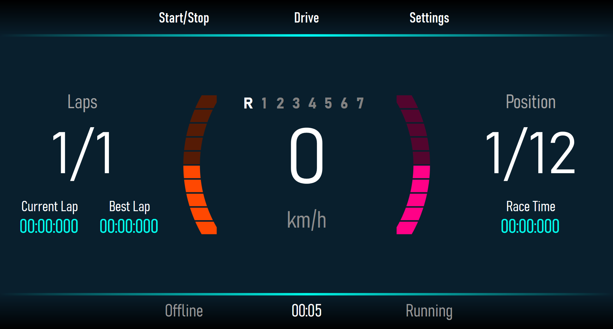

# neocluster
Application to get telemetry data from Forza Horizon 5. For now, it only grabs speed, RPM and gear data.

## Building

Open NeoCluster.sln with Visual Studio 2022 and build.

## References

[Forza Motorsport Data Out Reference](https://forums.forzamotorsport.net/turn10_postst128499_Forza-Motorsport-7--Data-Out--feature-details.aspx)